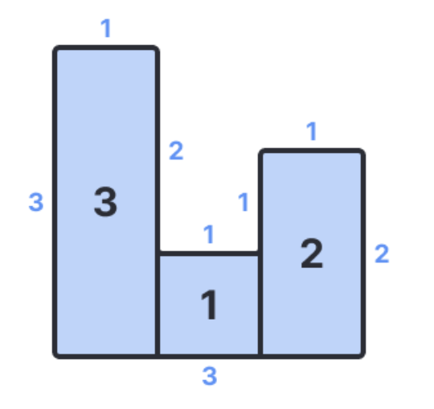

# [03. 기초수학] 울타리치기

### 문제

가로 방향 길이가 $1$로 동일한 직사각형 모양의 땅 $N$개가 빈틈없이 붙어있는 농장이 있다. 가장 왼쪽에 있는 땅부터 순서대로 $1,2, … ,  N$번째 땅이라고 부를 때, $1 \le i \le N$인 $i$에 대하여 $i$ 번째 땅의 세로 방향 길이를 $A_i$ 라 하자.

이 농장의 가장 자리에 울타리를 두를때, 울타리의 길이를 구하여라.

### 입력

첫째 줄에 농장을 이루는 땅의 수 $N$이 주어진다.

둘째 줄에 $i$번째 땅의 세로 방향 길이를 의미하는 $A_1, A_2, ... , A_N$이 공백을 두고 주어진다.

- $1 \le N \le 1000$
- $1 \le A_i \le 100 (1 \le i \le N)$
- 입력으로 주어지는 모든 수는 정수이다.

### 출력

농장의 가장 자리를 두르는 울타리의 길이를 출력한다.

### 예시

입력

```jsx
3;
123;
```



출력

```jsx
12;
```

---

### 🤧 풀이

우선 좌우 길이와 상하 길이를 따로 구하여 더해보자!

좌우 길이는 무조건 맨 처음 땅과 마지막 땅은 더해야 한다.

중간의 길이는 인접한 땅들 간의 높이 차이를 구하여 더한다.

상하 길이는 각 땅 당 가로길이는 1으로 고정이므로 `땅의 길이 * 2`를 해주면 끝!!
<br/>

### 제출 일자

2025년 4월 2일 수요일
